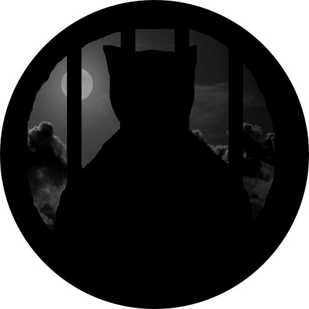

Project Prison XCape
--------------------
  

  

  

Prison XCape is a 2D platformer game that is made using a simple game engine
 built on the PyGame framework. The game contains several features, see 
 [Key Game Features](#key-game-features) and [Key Code Features](#key-code-features).
 
Some game play footage is demonstrated below.

|          Single player        |               Coop             |
:------------------------------:|:-------------------------------:
    |    |
------------------------------------------------------------------

Prerequisites
--------------
- Python 3.6.0
- PyGame 1.9.3

How to Use
----------
1. Download or clone the repository
2. Run main.py using a python interpreter 

Key Game Features
-----------------
- Single player mode, containing four levels.
- Local coop mode, containing three levels.
- A boss in both modes.
- Several menus and UI for both modes.
- Cutscenes for single player mode.

Key Code Features
-----------------
- Several engines (e.g. core, scene, menu, and collision).
- Swappable components that attach to any class (e.g render, audio, physics).
- Components that can easily be tweaked (e.g. animations, dialogues, camera).
- Loader module responsible for IO of images and audio.
- Event-driven communication between classes.

Authors
-------
|      Name      |           Email           | 
| -------------- |:-------------------------:| 
| Othman Alikhan | oz.alikhan@gmail.com      | 
| Gustavo León   | gustavol97_lp@hotmail.com |

Credits
-------
- Sound assets, cat meows, http://soundbible.com
- Sound assets, everything else, https://www.soundjay.com
- Artwork assets, ???

TODO
----

Programming
-----------
- Add evasion move for player
- Add disappearing platform
- Moving platform attachable code 

Artwork
-------
- Disappearing platform
- New type of door

Sounds
------
- Evade move
- Disappearing platform
- Ball trap

Level Designing
---------------
- SoloScene05 (Zone 2)